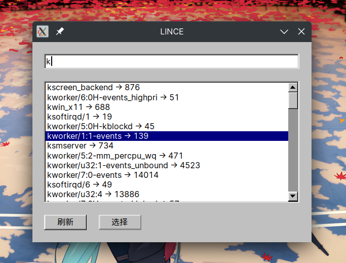

linux（包括android）版 cheat engine （支持图形界面和命令行操作并且公开abi） 龟速开发中

暂时业余时间瞎几把写中

距离可用还有很远的距离

todo idea 2022.03.21 13:40 ：一些胡乱的想法：不同类型的支持，utf8_str u8 u32 u64 等。 模糊搜索功能，把搜索到的每个地址存到一个map，loop不停的读取每个地址中的值，当触发有变化的时候，把当前每个地址的值存到一个map和上一次的对比，保留没有值没发生变化地址。无变化/有变化依然按照这个逻辑。搜索全部类型的值太多怎么办例如0/1？实际场景应该最多只有前三次结果会比较多，后面结果会按数量级减少，应该不用太担心性能？不知道还有没有更好的办法。。。代码中的x1函数是一个超大数组查找重复的东西，我使用了BlockQuickSort算法然后difference，不知道还有没有更好的办法+1。（雾。也许上面的想法应该自己实现一个数据结构？)，不对，似乎也不需要用个map存，对的对的，不对不对。

2022.03.16 lince有了第一个gui窗口！（雾

