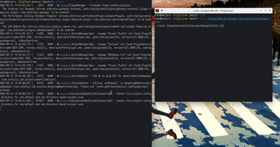

## 快速多平台内存扫描器 linux windows macos android/ios

> **开发中** 暂时业余时间瞎几把写中，，

## ⚠️ wip

优先级先后顺序：linux android windows macos ios

v0.1.1 linux功能列表，所有功能都不需要依赖ptrace。:

- 快速内存过滤

- 内存写入

- 内存冻结

- dump内存

- 注入动态库

目前拥有的功能：

内存冻结和dump，希望能兼顾cpu和内存占用低，并且性能非常好的内存过滤。

非常方便的直接注入so到目标进程。

开始使用：

请使用 57ef1b5078617bf383c346953c55e9e449a684b8 这次commit

编译需要安装nightly rust

```shell
cargo +nightly build -Z build-std=std,panic_abort -Z build-std-features=panic_immediate_abort --target x86_64-unknown-linux-musl --release
```

由于功能快速迭代中，暂时不提供预编译的二进制文件，而且rust环境那么方便。。。

## help WIP
```shell
./San -p 1234  #进程pid
find 9999  #搜索一个值 9999
find 9997  #这个值变成了 9997 后面find以此类推
write 0x12345678 2333  #向地址0x12345678写入2333
read 0x12345678 4  #读取0x12345678的四个字节
lock 0x12345678  #冻结0x12345678当前的值
inject /path/test.so  #向当前进程注入test.so，需要绝对路径
dump 0x12345678 10000 /path/file.dump  #dump 0x12345678处10000个字节到/path/file.dump，绝对路径
```




todo: 指针查找，准备以后可能弄出gui来再考虑。

如果有人想贡献代码，请注意，尽量不要再引入第三方库。

## changelog

2020.5
```
改名 meow

准备大量重构

尝试优化储存，2g -> 600mb

修复注入功能。
```

2020.4 
```
更新了libc，由于glibc的不兼容更改导致注入功能失效。

砍掉了多线程，每次扫描差异都把内存缓存到本地对比，大幅减少cpu使用，扫描期间内存占用变高，结束后内存占用不变。

```

2020.3 开始开发。

## Thanks for free JetBrains Open Source license


